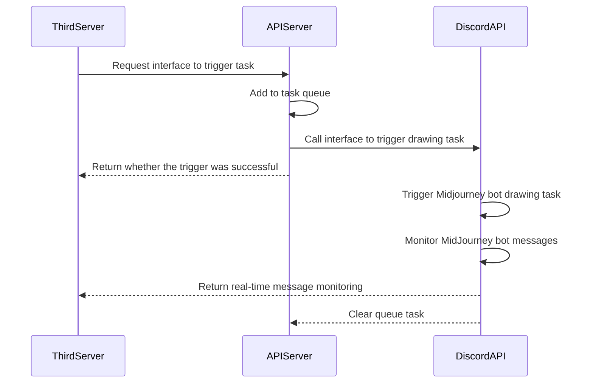

# midjourney-api

English / [简体中文](./README.md)

Based on the Discord Midjourney API.

**Add Midjourney Banned Words Entry [issue](https://github.com/yokonsan/midjourney-api/issues/new?assignees=&labels=banned+prompt&projects=&template=banned_prompt_report.yml&title=Banned+prompt%3A+)**

Refer to the project integration demo: [issue31](https://github.com/yokonsan/midjourney-api/issues/31)

<hr>

## Midjourney API Recommend
If the above process & code is difficult for you to operate, or maintaining a pool of accounts consumes a lot of your energy and cost. Here is a highly integrated and cost effective [Midjouney API](https://ttapi.io/midjourney) platform recommendation **[TTAPI](https://ttapi.io)** for price and stability.

**The TTAPI supports functions related to Midjourney:**
- imagine 
- U V pan zoom 
- describe 
- blend 
- vary_region and all other advanced features included in Midjourney.
- In addition to this there is support for the **Luma API**, the **Face Swap API**, the relatively inexpensive **ChatGPT**, and the **Claude API**.

**How to start with TTAPI**

- Just [Sign In With Github](https://ttapi.io/login), and than you will get 30 quota of free credits (can be used to 10 times imagine endpoint in fast mode for testing).
- [For complete docs of TTAPI](https://ttapi.io/docs)

<hr>


## UML



## Usage Requirements

1. Ensure the program's runtime environment can access Discord
2. Have Midjourney and Discord accounts
3. Create a Discord channel and add the bot, refer to the tutorial [Midjourney｜How to Integrate into Your Own Platform](https://mp.weixin.qq.com/s?__biz=Mzg4MjkzMzc1Mg==&mid=2247484029&idx=1&sn=d3c458bba9459f19f05d13ab23f5f67e&chksm=cf4e68eaf839e1fc2db025bd9940d0f5e57862f1788c88215b4a66cb23f553a30c5f37ac3ae8&token=79614426&lang=zh_CN#rd)


## Installation and Startup

```bash
git clone
pip install -r requirements.txt
```

Rename the file `.env.template` to `.env` and fill in the parameter values:

```
USER_TOKEN=User token
BOT_TOKEN=Bot token
GUILD_ID=Server ID
CHANNEL_ID=Channel ID
CALLBACK_URL=Callback URL, default is HTTP POST request, used for receiving midjourney drawing progress and results
```

### Direct Startup

```bash
# Start the bot listener
python task_bot.py
# Start the HTTP service
python server.py
```

#### Update

```bash
git pull

# Start the bot listener
python task_bot.py
# Start the HTTP service
python server.py
```

### Docker Startup

Fill in the environment variables after `-e` in [start.sh](./start.sh) and start directly:

```bash
sh start.sh
```

Or build the image locally:

```bash
# Build the image
sh build.sh
# Start the container
sh start.sh
```

#### Update

```bash
docker rmi kunyu/midjourney-api:1.0
sh start.sh
```

API `swagger` documentation: [http://127.0.0.1:8062/docs](http://127.0.0.1:8062/docs)

`midjourney-api` provides interfaces:

- [x]  `/v1/api/trigger/imagine`: Trigger drawing task (image-to-image, add image link before the prompt)
- [x]  `/v1/api/trigger/upscale`: U
- [x]  `/v1/api/trigger/variation`: V
- [x]  `/v1/api/trigger/solo_variation`: Make Variations
- [x]  `/v1/api/trigger/solo_low_variation`: Vary(Subtle)
- [x]  `/v1/api/trigger/solo_high_variation`: Vary(Strong)
- [x]  `/v1/api/trigger/zoomout`: Zoom Out 2x/1.5x
- [x]  `/v1/api/trigger/expand`: ⬅️ ➡️ ⬆️ ⬇️
- [x]  `/v1/api/trigger/reset`: Redraw
- [x]  `/v1/api/trigger/upload`: Upload image
- [x]  `/v1/api/trigger/describe`: Generate prompt by uploading image name
- [x] `/v1/api/trigger/message`: Send image message, return image link for image-to-image functionality


## Usage

### Imagine

Text-to-image

```bash
curl -X 'POST' \
  'http://127.0.0.1:8062/v1/api/trigger/imagine' \
  -H 'accept: application/json' \
  -H 'Content-Type: application/json' \
  -d '{
  "prompt": "a cute cat"
}'
```

Image-to-image, must include the image URL

```bash
curl -X 'POST' \
  'http://127.0.0.1:8062/v1/api/trigger/imagine' \
  -H 'accept: application/json' \
  -H 'Content-Type: application/json' \
  -d '{
  "prompt": "a cute cat",
  "picurl": "https://xxxxxx/xxxxxxxxxxxx.jpg"
}'
```

### Upscale

```bash
curl -X 'POST' \
  'http://127.0.0.1:8062/v1/api/trigger/upscale' \
  -H 'accept: application/json' \
  -H 'Content-Type: application/json' \
  -d '{
  "index": 1,
  "msg_id": "xxxxxxxxxx",
  "msg_hash": "xxxxx-xxx-xxxx-xxxx-xxxxxx",
  "trigger_id": "xxxxxxxxxx"
}'
```

- `index`: Image index, values: 1, 2, 3, 4
- `msg_id`: `imagine` callback message `id` field after drawing completion
- `msg_hash`: `imagine` callback message `attachments[0].filename.split("_")[-1].split(".")[0]` after drawing completion
- `trigger_id`: `imagine` callback message `trigger_id` field after drawing completion

### Variation

```bash
curl -X 'POST' \
  'http://127.0.0.1:8062/v1/api/trigger/variation' \
  -H 'accept: application/json' \
  -H 'Content-Type: application/json' \
  -d '{
  "index": 2,
  "msg_id": "xxxxxxxxxx",
  "msg_hash": "xxxxx-xxx-xxxx-xxxx-xxxxxx",
  "trigger_id": "xxxxxxxxxx"
}'
```

### Solo Variation

Perform "Make Variations" on a single image from `upscale`

```bash
curl -X 'POST' \
  'http://127.0.0.1:8062/v1/api/trigger/solo_variation' \
  -H 'accept: application/json' \
  -H 'Content-Type: application/json' \
  -d '{
  "index": 1,
  "msg_id": "xxxxxxxxxx",
  "msg_hash": "xxxxx-xxx-xxxx-xxxx-xxxxxx",
  "trigger_id": "xxxxxxxxxx"
}'
```

- `index`: Image index, not used here, value: 1
- `msg_id`: `upscale` callback message `id` field after drawing completion
- `msg_hash`: `upscale` callback message `attachments[0].filename.split("_")[-1].split(".")[0]` after drawing completion
- `trigger_id`: `upscale` callback message `trigger_id` field after drawing completion

### Solo Low Variation

Perform "Vary(Subtle)" on a single image from `upscale`

```bash
curl -X 'POST' \
  'http://127.0.0.1:8062/v1/api/trigger/solo_low_variation' \
  -H 'accept: application/json' \
  -H 'Content-Type: application/json' \
  -d '{
  "index": 1,
  "msg_id": "xxxxxxxxxx",
  "msg_hash": "xxxxx-xxx-xxxx-xxxx-xxxxxx",
  "trigger_id": "xxxxxxxxxx"
}'
```

- `index`: Image index, not used here, value: 1
- `msg_id`: `upscale` callback message `id` field after drawing completion
- `msg_hash`: `upscale` callback message `attachments[0].filename.split("_")[-1].split(".")[0]` after drawing completion
- `trigger_id`: `upscale` callback message `trigger_id` field after drawing completion

### Solo High Variation

Perform "Vary(Strong)" on a single image from `upscale`

```bash
curl -X 'POST' \
  'http://127.0.0.1:8062/v1/api/trigger/solo_high_variation' \
  -H 'accept: application/json' \
  -H 'Content-Type: application/json' \
  -d '{
  "index": 1,
  "msg_id": "xxxxxxxxxx",
  "msg_hash": "xxxxx-xxx-xxxx-xxxx-xxxxxx",
  "trigger_id": "xxxxxxxxxx"
}'
```

- `index`: Image index, not used here, value: 1
- `msg_id`: `upscale` callback message `id` field after drawing completion
- `msg_hash`: `upscale` callback message `attachments[0].filename.split("_")[-1].split(".")[0]` after drawing completion
- `trigger_id`: `upscale` callback message `trigger_id` field after drawing completion


### Zoom Out

Perform Zoom Out 2x/1.5x on a single image from `upscale`

```bash
curl -X 'POST' \
  'http://127.0.0.1:8062/v1/api/trigger/zoomout' \
  -H 'accept: application/json' \
  -H 'Content-Type: application/json' \
  -d '{
  "msg_id": "xxxxxxxxxx",
  "msg_hash": "xxxxx-xxx-xxxx-xxxx-xxxxxx",
  "zoomout": 50
  "trigger_id": "xxxxxxxxxx"
}'
```

- `zoomout`: Image enlargement (Outpaint) factor, 2x -> 50, 1.5x -> 75


### Expand

Perform expansion in a specific direction on a single image from `upscale`

```bash
curl -X 'POST' \
  'http://127.0.0.1:8062/v1/api/trigger/expand' \
  -H 'accept: application/json' \
  -H 'Content-Type: application/json' \
  -d '{
  "msg_id": "xxxxxxxxxx",
  "msg_hash": "xxxxx-xxx-xxxx-xxxx-xxxxxx",
  "direction": "up"
  "trigger_id": "xxxxxxxxxx"
}'
```

- `direction`: Image expansion direction, values: left/right/up/down


### Reset

```bash
curl -X 'POST' \
  'http://127.0.0.1:8062/v1/api/trigger/reset' \
  -H 'accept: application/json' \
  -H 'Content-Type: application/json' \
  -d '{
  "msg_id": "xxxxxxxxxx",
  "msg_hash": "xxxxx-xxx-xxxx-xxxx-xxxxxx",
  "trigger_id": "xxxxxxxxxx"
}'
```

### Describe

1. First, upload the image

```bash
curl -X 'POST' \
  'http://127.0.0.1:8062/v1/api/trigger/upload' \
  -H 'accept: application/json' \
  -H 'Content-Type: multipart/form-data' \
  -F 'file=@cH16Ifh.jpg;type=image/jpeg'
```

2. Based on the returned image filename, call describe

```bash
curl -X 'POST' \
  'http://127.0.0.1:8062/v1/api/trigger/describe' \
  -H 'accept: application/json' \
  -H 'Content-Type: application/json' \
  -d '{
  "upload_filename": "b56ca21a-5fbe-40b4-89ab-6e0aa732f561/9231228408.jpg",
  "trigger_id": "9231228408"
}'
```

- `trigger_id`: Use the trigger_id returned by upload first
- `upload_filename`: Filename returned by upload

### Message

Same as `describe`, first `/v1/api/trigger/upload` to upload the image, then send the message based on the returned filename:

```bash
curl -X 'POST' \
  'http://127.0.0.1:8062/v1/api/trigger/message' \
  -H 'accept: application/json' \
  -H 'Content-Type: application/json' \
  -d '{
  "upload_filename": "560a1e26-36a2-4d5f-a48d-9dd877642b51/7185811546.jpg"
}'
```

After sending the image, an image link will be returned.
This link is used in image-to-image, concatenating the prompt in the form `ImageURL Prompt`, calling `/v1/api/trigger/imagine`.


## Features

- [x] imagine
- [x] upscale
- [x] variation
- [x] solo_variation
- [x] solo_low_variation
- [x] solo_high_variation
- [x] zoomout
- [x] expand
- [x] reset
- [x] describe
- [x] Image-to-image (obtain the link of the uploaded image)
- [x] Sensitive word filtering and reporting
- [x] Task queue (in-memory storage, external storage is not preferred, but can add exception handling for persistence)
- [ ] tests


## enjoy it
