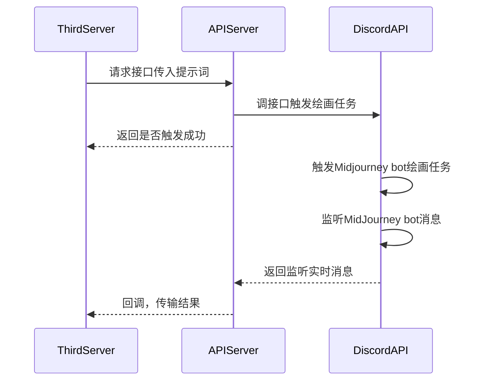

# midjourney-api

基于 Discord 的 Midjourney API。

使用教程参考：[Midjourney｜如何集成到自己的平台](https://mp.weixin.qq.com/s?__biz=Mzg4MjkzMzc1Mg==&mid=2247484029&idx=1&sn=d3c458bba9459f19f05d13ab23f5f67e&chksm=cf4e68eaf839e1fc2db025bd9940d0f5e57862f1788c88215b4a66cb23f553a30c5f37ac3ae8&token=79614426&lang=zh_CN#rd)

## todo

integrate fastapi with websocket listening discord message.

## UML



## 安装启动

```bash
git clone
poetry install
```

将文件`.env.template`重命名为`.env`，并填入参数值：

```
USER_TOKEN=用户token
BOT_TOKEN=机器人token
GUILD_ID=服务器ID
CHANNEL_ID=频道ID
CALLBACK_URL=回调地址，默认http post请求
```

### 直接启动

```bash
# 启动http服务
python main_server.py

# 启动监听机器人
python main_discord.py
```

### docker 启动

填写 [start.sh](./start.sh) 中 `-e` 后的环境变量，直接启动：

```bash
sh start.sh
```

或者本地构建镜像：

```bash
# 构建镜像
sh build.sh
# 启动容器
sh start.sh
```

接口`swagger`文档：[http://127.0.0.1:8062/docs](http://127.0.0.1:8062/docs)

`midjourney-api` 提供接口：

- [x]  `/v1/api/trigger/imagine`：触发绘画任务
- [x]  `/v1/api/trigger/upscale`：U
- [x]  `/v1/api/trigger/variation`：V
- [x]  `/v1/api/trigger/reset`：重绘
- [ ]  `/v1/api/upload`：上传图片，触发任务，待开发

## 使用

### imagine

```bash
curl -X 'POST' \
  'http://127.0.0.1:8062/v1/api/trigger/imagine' \
  -H 'accept: application/json' \
  -H 'Content-Type: application/json' \
  -d '{
  "prompt": "a cute cat"
}'
```

### upscale

```bash
curl -X 'POST' \
  'http://127.0.0.1:8062/v1/api/trigger/upscale' \
  -H 'accept: application/json' \
  -H 'Content-Type: application/json' \
  -d '{
  "index": 1,
  "msg_id": "xxxxxxxxxx",
  "msg_hash": "xxxxx-xxx-xxxx-xxxx-xxxxxx",
  "trigger_id": "xxxxxxxxxx"
}'
```

- `index`: 图片索引，取值：1、2、3、4
- `msg_id`: `imagine` 绘画完成后回调报文 `id` 字段
- `msg_hash`: `imagine` 绘画完成后回调报文 `attachments[0].filename.split("_")[-1].split(".").[0]`
- `trigger_id`: `imagine` 绘画完成后回调报文 `trigger_id` 字段

### variation

```bash
curl -X 'POST' \
  'http://127.0.0.1:8062/v1/api/trigger/variation' \
  -H 'accept: application/json' \
  -H 'Content-Type: application/json' \
  -d '{
  "index": 2,
  "msg_id": "xxxxxxxxxx",
  "msg_hash": "xxxxx-xxx-xxxx-xxxx-xxxxxx",
  "trigger_id": "xxxxxxxxxx"
}'
```

### reset

```bash
curl -X 'POST' \
  'http://127.0.0.1:8062/v1/api/trigger/reset' \
  -H 'accept: application/json' \
  -H 'Content-Type: application/json' \
  -d '{
  "msg_id": "xxxxxxxxxx",
  "msg_hash": "xxxxx-xxx-xxxx-xxxx-xxxxxx",
  "trigger_id": "xxxxxxxxxx"
}'
```

## 功能

- [x] 文生图
- [x] upscale
- [x] variation
- [x] reset
- [ ] 图生图

## enjoy it

---

