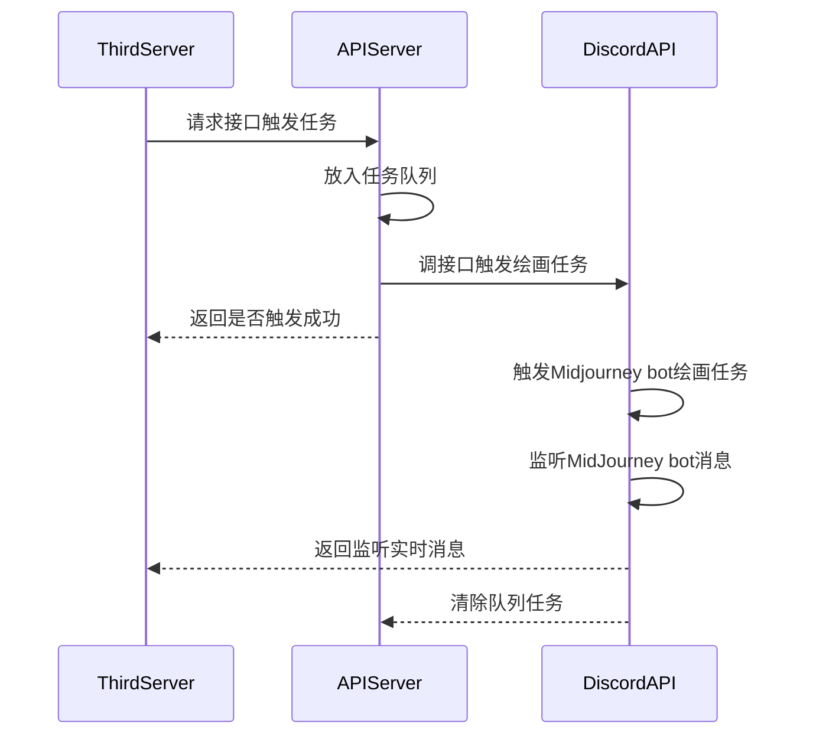

# midjourney-api

基于 Discord 的 Midjourney API。

**添加 Midjourney 违禁词入口 [issue](https://github.com/yokonsan/midjourney-api/issues/new?assignees=&labels=banned+prompt&projects=&template=banned_prompt_report.yml&title=Banned+prompt%3A+)**

项目集成 Demo 参考：[issue31](https://github.com/yokonsan/midjourney-api/issues/31)


## UML



## 使用条件

1. 确保程序启动环境能访问 Discord
2. 已有 Midjourney、Discord 账户
3. 创建 Discord 频道并添加机器人，参考教程 [Midjourney｜如何集成到自己的平台](https://mp.weixin.qq.com/s?__biz=Mzg4MjkzMzc1Mg==&mid=2247484029&idx=1&sn=d3c458bba9459f19f05d13ab23f5f67e&chksm=cf4e68eaf839e1fc2db025bd9940d0f5e57862f1788c88215b4a66cb23f553a30c5f37ac3ae8&token=79614426&lang=zh_CN#rd)


## 安装启动

```bash
git clone
pip install -r requirements.txt
```

将文件`.env.template`重命名为`.env`，并填入参数值：

```
USER_TOKEN=用户token
BOT_TOKEN=机器人token
GUILD_ID=服务器ID
CHANNEL_ID=频道ID
CALLBACK_URL=回调地址，默认http post请求，用于接收 midjourney 作图进度和结果的服务
```

### 直接启动

```bash
# 启动监听机器人
python task_bot.py
# 启动http服务
python server.py
```

#### 更新

```bash
git pull

# 启动监听机器人
python task_bot.py
# 启动http服务
python server.py
```

### docker 启动

填写 [start.sh](./start.sh) 中 `-e` 后的环境变量，直接启动：

```bash
sh start.sh
```

或者本地构建镜像：

```bash
# 构建镜像
sh build.sh
# 启动容器
sh start.sh
```

#### 更新

```bash
docker rmi kunyu/midjourney-api:1.0
sh start.sh
```

接口`swagger`文档：[http://127.0.0.1:8062/docs](http://127.0.0.1:8062/docs)

`midjourney-api` 提供接口：

- [x]  `/v1/api/trigger/imagine`：触发绘画任务（图生图，Prompt 前加上图片链接即可）
- [x]  `/v1/api/trigger/upscale`：U
- [x]  `/v1/api/trigger/variation`：V
- [x]  `/v1/api/trigger/reset`：重绘
- [x]  `/v1/api/trigger/upload`：上传图片
- [x]  `/v1/api/trigger/describe`：通过上传图片名，生成 Prompt
- [x] `/v1/api/trigger/message`：发送图片消息，返回图片链接，用于图生图功能


## 使用

### imagine

文生图

```bash
curl -X 'POST' \
  'http://127.0.0.1:8062/v1/api/trigger/imagine' \
  -H 'accept: application/json' \
  -H 'Content-Type: application/json' \
  -d '{
  "prompt": "a cute cat"
}'
```

图生图，需带上图片 URL

```bash
curl -X 'POST' \
  'http://127.0.0.1:8062/v1/api/trigger/imagine' \
  -H 'accept: application/json' \
  -H 'Content-Type: application/json' \
  -d '{
  "prompt": "a cute cat",
  "picurl": "https://xxxxxx/xxxxxxxxxxxx.jpg"
}'
```

### upscale

```bash
curl -X 'POST' \
  'http://127.0.0.1:8062/v1/api/trigger/upscale' \
  -H 'accept: application/json' \
  -H 'Content-Type: application/json' \
  -d '{
  "index": 1,
  "msg_id": "xxxxxxxxxx",
  "msg_hash": "xxxxx-xxx-xxxx-xxxx-xxxxxx",
  "trigger_id": "xxxxxxxxxx"
}'
```

- `index`: 图片索引，取值：1、2、3、4
- `msg_id`: `imagine` 绘画完成后回调报文 `id` 字段
- `msg_hash`: `imagine` 绘画完成后回调报文 `attachments[0].filename.split("_")[-1].split(".").[0]`
- `trigger_id`: `imagine` 绘画完成后回调报文 `trigger_id` 字段

### variation

```bash
curl -X 'POST' \
  'http://127.0.0.1:8062/v1/api/trigger/variation' \
  -H 'accept: application/json' \
  -H 'Content-Type: application/json' \
  -d '{
  "index": 2,
  "msg_id": "xxxxxxxxxx",
  "msg_hash": "xxxxx-xxx-xxxx-xxxx-xxxxxx",
  "trigger_id": "xxxxxxxxxx"
}'
```

### reset

```bash
curl -X 'POST' \
  'http://127.0.0.1:8062/v1/api/trigger/reset' \
  -H 'accept: application/json' \
  -H 'Content-Type: application/json' \
  -d '{
  "msg_id": "xxxxxxxxxx",
  "msg_hash": "xxxxx-xxx-xxxx-xxxx-xxxxxx",
  "trigger_id": "xxxxxxxxxx"
}'
```

### describe

1. 先上传图片

```bash
curl -X 'POST' \
  'http://127.0.0.1:8062/v1/api/trigger/upload' \
  -H 'accept: application/json' \
  -H 'Content-Type: multipart/form-data' \
  -F 'file=@cH16Ifh.jpg;type=image/jpeg'
```

2. 根据返回的图片文件名，调用 describe

```bash
curl -X 'POST' \
  'http://127.0.0.1:8062/v1/api/trigger/describe' \
  -H 'accept: application/json' \
  -H 'Content-Type: application/json' \
  -d '{
  "upload_filename": "b56ca21a-5fbe-40b4-89ab-6e0aa732f561/9231228408.jpg",
  "trigger_id": "9231228408"
}'
```

- `trigger_id` 先用 upload 返回的 trigger_id
- `upload_filename` upload 返回的文件名

### message

和 `describe` 一样，先 `/v1/api/trigger/upload` 上传图片，然后根据返回文件名，发送消息：

```bash
curl -X 'POST' \
  'http://127.0.0.1:8062/v1/api/trigger/message' \
  -H 'accept: application/json' \
  -H 'Content-Type: application/json' \
  -d '{
  "upload_filename": "560a1e26-36a2-4d5f-a48d-9dd877642b51/7185811546.jpg"
}'
```

发送图片后，会返回图片链接。
该链接用于以图生图中，拼接 Prompt 形如 `图片URL Prompt`，调用 `/v1/api/trigger/imagine`。


## 功能

- [x] imagine
- [x] upscale
- [x] variation
- [x] reset
- [x] describe
- [x] 图生图（获取到上传图片的链接）
- [x] 敏感词过滤上报
- [x] 任务队列（内存存储，不希望引入外建，可加入异常落盘）
- [ ] tests

## enjoy it
