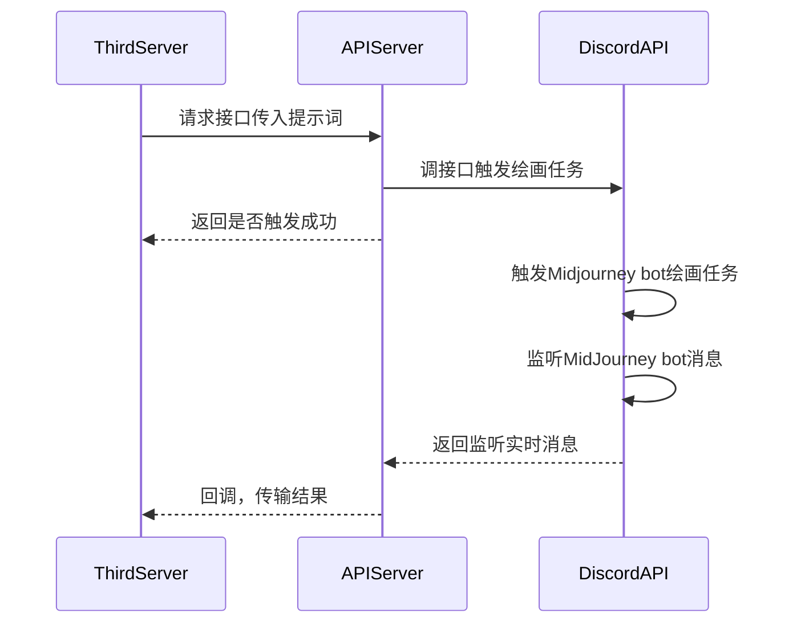

# midjourney-api

基于 Discord 的 Midjourney API

## UML




## 安装启动

```bash
git clone
pip install -r requirements.txt
```

将文件`.env.template`重命名为`.env`，并填入参数值：

```
USER_TOKEN=用户token
BOT_TOKEN=机器人token
GUILD_ID=服务器ID
CHANNEL_ID=频道ID
CALLBACK_URL=回调地址，默认http post请求
```

### 直接启动

```bash
# 启动监听机器人
python task_bot.py
# 启动http服务
python server.py
```

### docker 启动

填写 [start.sh](./start.sh) 环境变量，启动：

```bash
# 构建镜像
sh build.sh
# 启动容器
sh start.sh
```

接口`swagger`文档：[http://127.0.0.1:8062/docs](http://127.0.0.1:8062/docs)

`midjourney-api` 提供接口：

1. `/v1/api/trigger/bot`：触发绘画任务，已完成
2. `/v1/api/upload`：上传图片，触发任务，待开发


## 功能

- [x] 文生图
- [x] upscale
- [x] variation
- [x] reset
- [ ] 图生图
